# Getting Started

I have 2 VM's in the cloud. Both VM's are running Fedora 26.
+ Web Server: `100.66.1.18`
+ Database Server: `100.66.2.18`

## Web Server

First, let's configure and harden the webserver.

`ssh parksjg@100.66.1.18`

Now, we need to install some things,

`sudo yum install yum-cron-security` (This automatically updates security packages)

`sudo yum update -y`

`yum install php httpd php-mysqlnd`

this will install Apache, MySql, and PHP.

Start Apache with

`service httpd restart`

and make Apache start on boot

`chkconfig httpd on`

Now stop firewalld and erase it,

`sudo systemctl stop firewalld`

`sudo dnf erase firewalld`

Next, install the firewall-tui and iptables,

`sudo dnf install system-config-firewall-tui`

`sudo dnf install iptables-services`

Run the tui,

`sudo system-config-firewall-tui`

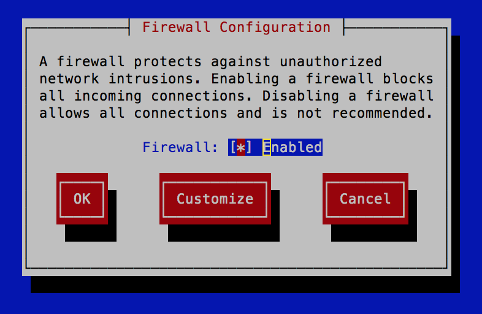

Enable and go to **Customize**.

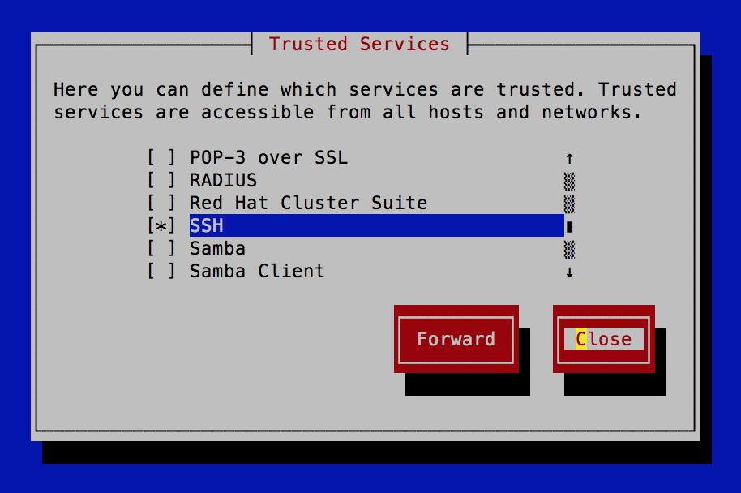

Be sure to select **SSH**, **WWW**, and **Secure WWW***. This will open ports 22, 80, and 443. When done click on **Close**. Then select **Ok** and then **Yes**. Now that we are done configureing the firewall, let's check that our settings are correct.

`sudo cat /etc/sysconfig/iptables`

The output should yield the following:

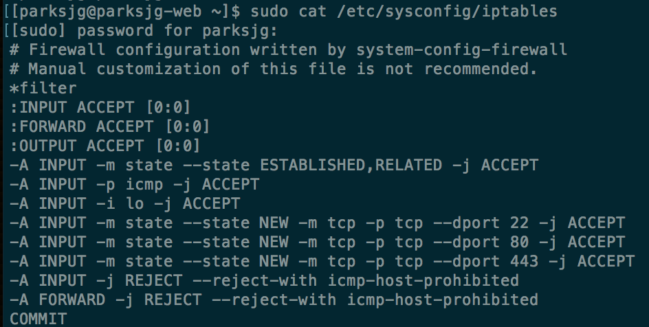

Great!

## Database Server

Now, let's configure and harden the database server.

`ssh parksjg@100.66.2.18`

`sudo yum install yum-cron-security` (This automatically updates security packages)

`sudo yum update -y`

Now add MariaDB

`sudo dnf install mariadb -y`

`sudo dnf install mariadb-server -y`

`sudo chkconfig mariadb on` (Set mariadb to start on boot)

`setenforce 0` (SE Linux set to 'Enforcing')

`sudo service mariadb start`

Next, let's lock down MySQL

`sudo mysql_secure_installation`

Add a root password, remove anonymous users, disallow root login remotely, remove test database and access to it, and reload the privileges table.

The database server needs to have MySQL allowed in on TCP port 3306. So, let's set up the firewall. This time we will do it slightly different.

`sudo systemctl stop firewalld`

`sudo dnf erase firewalld`

`sudo dnf install system-config-firewall-tui`

`sudo dnf install iptable-services`

Now, use the tui to allow **SSH**, but do not allow anything else. Next, we will add MySQL to iptables from the command line.

`sudo iptables -L -n --line-numbers`

And you should see the following:
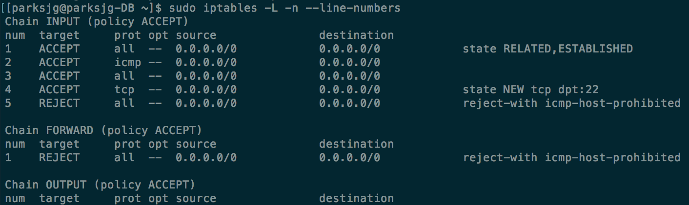

Now let's add port 3306 for MySQL

`sudo iptables -I INPUT 5 -s 100.66.1.18 -p TCP -m state --state new -m tcp --dport 3306 -j ACCEPT`

`sudo service iptables save`

`sudo service iptables restart`

Then run

`sudo iptables -L -n --line-numbers`

And check that you get the following:

Now transfer the collective.sql file to the database server at `100.66.2.18`. I used **FileZilla** to do this.

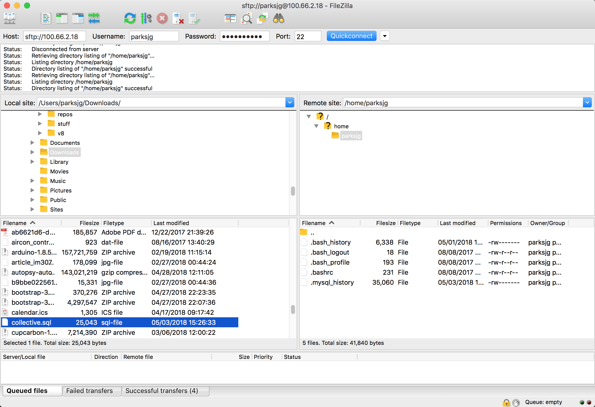

And once the file is transfered,

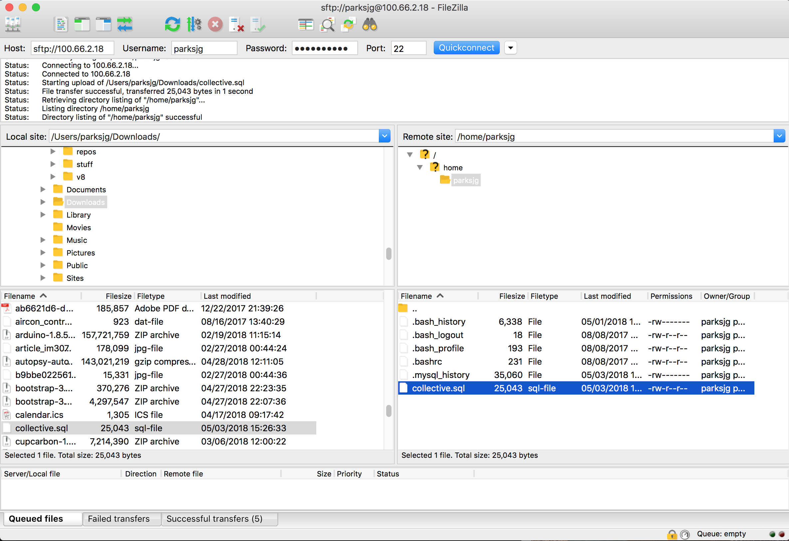

The file has been successfully transfered.

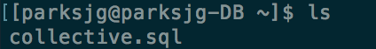

Now import collective.sql into MySQL with

`mysql -uroot -p < collective.sql`

`mysql -uroot -p collective`

`> show tables;`

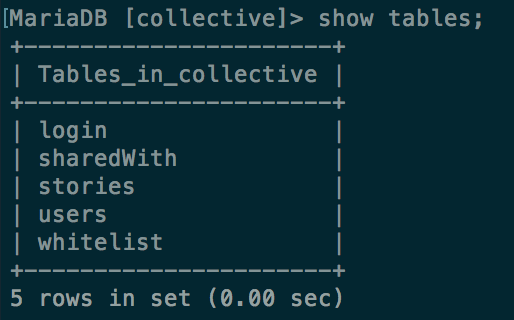

`> quit`

Now we need to create a new user in our MySQL that has access to the collective database.

`mysql -uroot -p`

`> create user 'ralphie'@'100.66.1.18' identified by 'buffalo';`

`grant select, insert, update, delete on collective.* to 'ralphie'@'100.66.1.18' identified by 'buffalo';`

Great!

## Back to the Web Server

Now `ssh` into the web server (100.66.1.18) and try to connect to the database

`ssh parksjg@100.66.1.18`

`mysql -uralphie -p collective -h 100.66.2.18`

Remember, the password for 'ralphie' is `buffalo`.

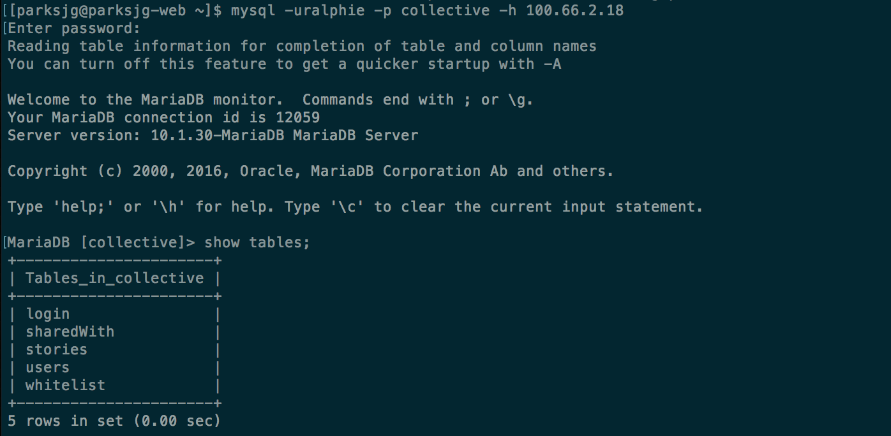

We can access the database from the web server!

Now, on the web server (100.66.1.18), we need to create a MySQL ini file to store the credentials for connecting to our database at 100.66.2.18. We will store this file outside of the document root as part of a layered security approach. We will place it in `/etc` and give only Apache special permission to read the file from there. The file name needs to be `collective.conf`.

`sudo vi /etc/collective.conf`

Now add the following:

[mysql]

user = ralphie

pass = buffalo

host = 100.66.2.18

port = 3306

dbName = collective

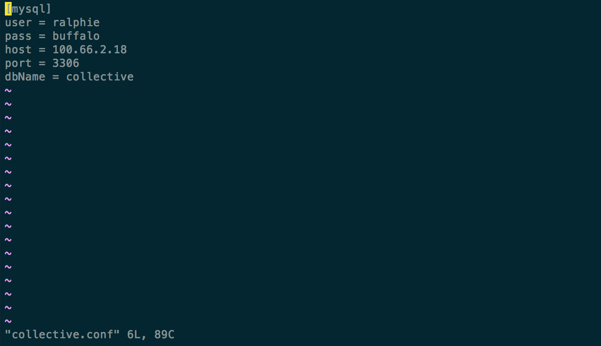

Write and quit the file.

The web server needs access to this file. So next we grant permissions.

`sudo chmod 700 /etc/collective.conf`

`sudo chown apache:apache /etc/collective.conf`

Excellent!

Now, still on the web server (100.66.1.18), let's go to the document root and creat a new directory for the webapp.

`cd /var/www/html`

`sudo mkdir collective`

`cd collective`

And now if we type `pwd` we should get `/var/www/html/collective`. Next let's connect to the web server (100.66.1.18) with FileZilla to transfer all the files for the webapp.

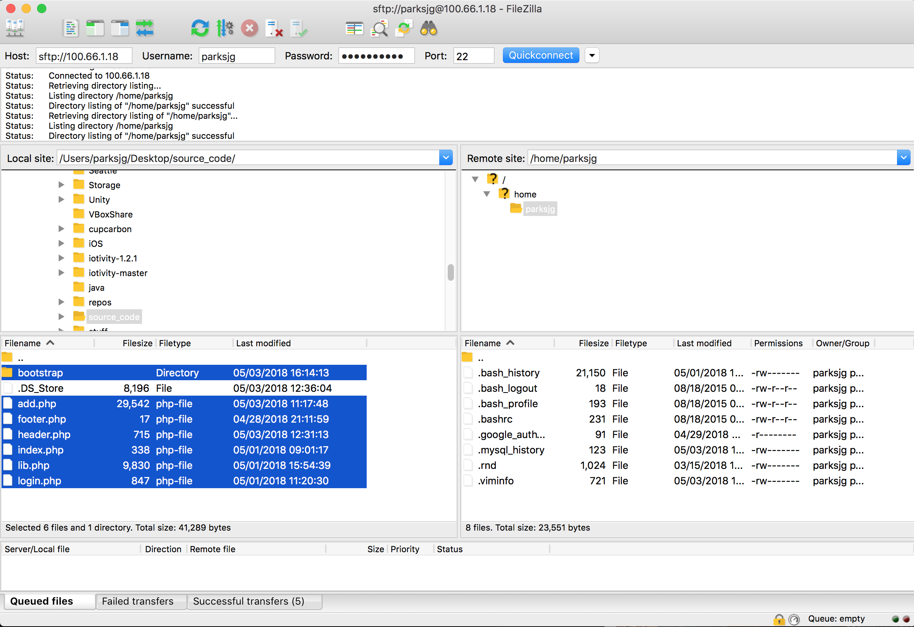

Do a quick `ls` to check for the following files: **add.php**, **bootstrap**, **footer.php**, **header.php**, **index.php**, **lib.php**, and **login.php**.

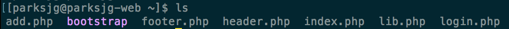

Now that all the files are on the web server, let's move them to our document root at `/var/www/html/collective/`.

`sudo mv add.php footer.php header.php index.php lib.php login.php bootstrap/ /var/www/html/collective/`

Then `cd` into the document root and check that you have the following:

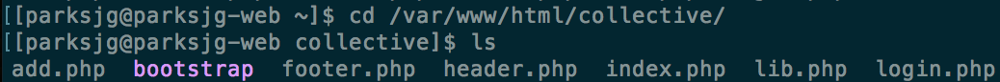

Still on the web server (100.66.1.18), install mod_ssl.

`sudo yum install mod_ssl`

Restart Apache:

`sudo service httpd restart`

Check that Apache is now listening on port 443:

`sudo netstat -an | grep 443`

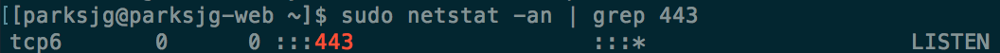

Next, we need to change `httpd.conf` to forward any port 80 traffic to HTTPS on 443.

`sudo vi /etc/httpd/conf/httpd.conf`

At the very bottom of `httpd.conf` add the following:

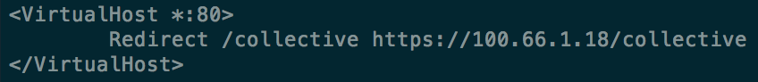

Write and quit the file. Go ahead and restart Apache again.

`sudo service httpd restart`
