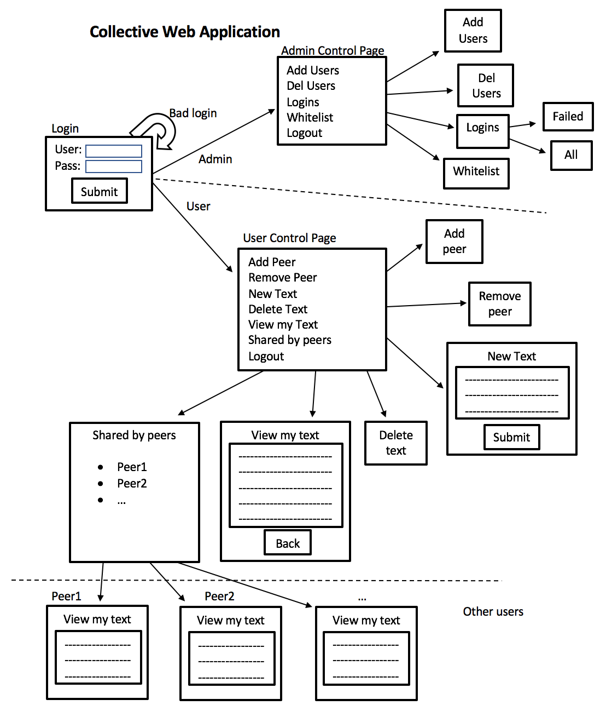
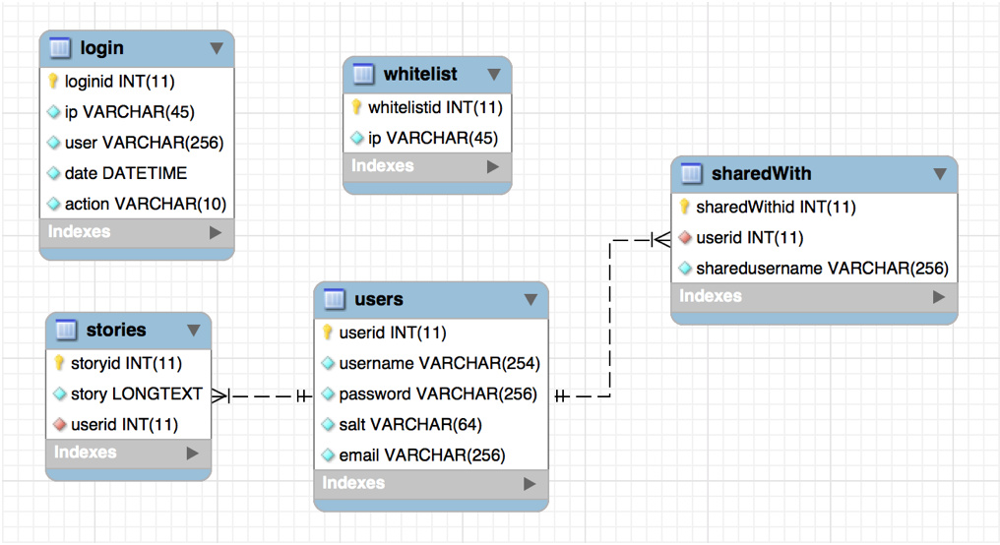

# Collective
**Secure Story Sharing Webapp**

The Collective web application will enable the sharing of encrypted text among users of the system. All text will be encrypted and inaccessible for the admin. A user can enter and store text associated with their username into the database. This text is only unencrypted for the user who owns it, but the user who owns it can also share access to the unencrypted text to other users by their username. The owner can also remove the access granted to other users. In this way, we have a secure information sharing platform. I imagine writers, journalists, doctors, and scientists using the Collective web app to share their ideas and works in progress with their peers. In return the Collective web app would ensure the security of user’s data. The users own their data, Collective provides the service of keeping that data private, even from Collective itself.

## Security Features

Secured in layers.
  + Require authentication
  + Logging failed and suspicous logins
  + Brute force password protection
  + Hardened web and database servers
  + Firewall and iptables to secure ports
  + Redirect users to HTTPS
  + Encrypt passwords with SHA256 and user-unique salt
  + Encrypt data with Symmetric AES 256 with user-unique salt
  + Sessions
  + Prepared SQL statements
  + Checks for SQLi
  
  
  ## Application Layout
  
  
  
  
  ## Database Schema
  
  
