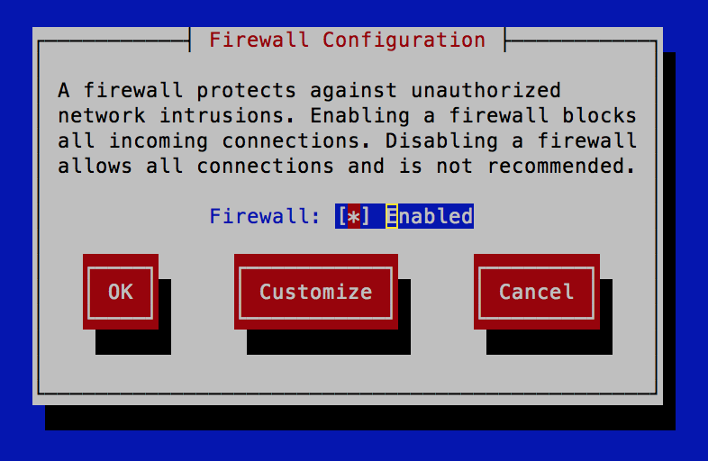
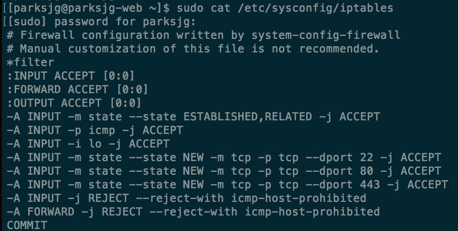
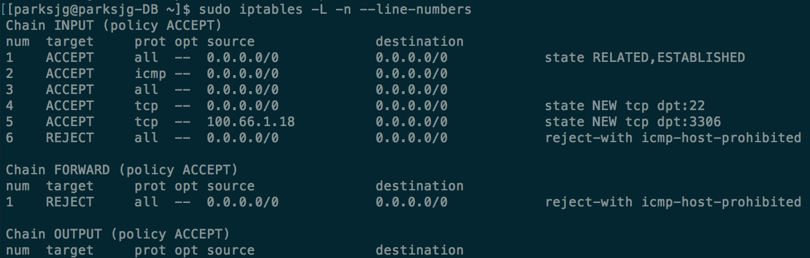
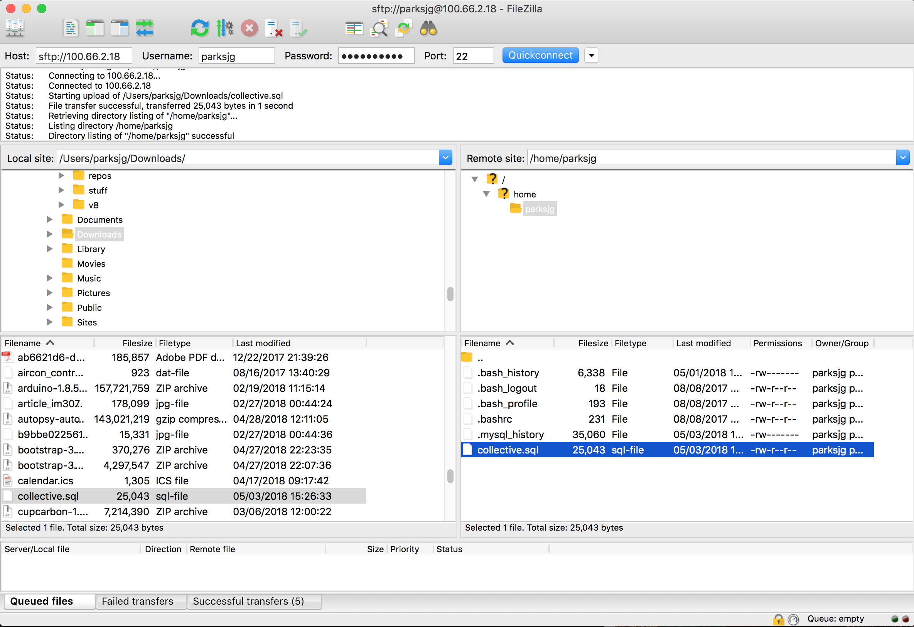

# Collective
**Secure Story Sharing Webapp**

The Collective web application will enable the sharing of encrypted text among users of the system. All text will be encrypted and inaccessible for the admin. A user can enter and store text associated with their username into the database. This text is only unencrypted for the user who owns it, but the user who owns it can also share access to the unencrypted text to other users by their username. The owner can also remove the access granted to other users. In this way, we have a secure information sharing platform. I imagine writers, journalists, doctors, and scientists using the Collective web app to share their ideas and works in progress with their peers. In return the Collective web app would ensure the security of user’s data. The users own their data, Collective provides the service of keeping that data private, even from Collective itself.

## Getting Started

I have 2 VM's in the cloud. Both VM's are running Fedora 26.
+ Web Server: `100.66.1.18`
+ Database Server: `100.66.2.18`

First, let's configure and harden the webserver.

`ssh parksjg@100.66.1.18`

Now, we need to install some things,

`sudo yum install yum-cron-security` (This automatically updates security packages)

`sudo yum update -y`

`yum install php httpd php-mysqlnd`

this will install Apache, MySql, and PHP.

Start Apache with

`service httpd restart`

and make Apache start on boot

`chkconfig httpd on`

Now stop firewalld and erase it,

`sudo systemctl stop firewalld`

`sudo dnf erase firewalld`

Next, install the firewall-tui and iptables,

`sudo dnf install system-config-firewall-tui`

`sudo dnf install iptables-services`

Run the tui,

`sudo system-config-firewall-tui`

Enable and go to **Customize**.

Be sure to select **SSH**, **WWW**, and **Secure WWW***. This will open ports 22, 80, and 443. When done click on **Close**. Then select **Ok** and then **Yes**. Now that we are done configureing the firewall, let's check that our settings are correct.

`sudo cat /etc/sysconfig/iptables`

The output should yield the following:

Great!
Now, let's configure and harden the database server.

`ssh parksjg@100.66.2.18`

`sudo yum install yum-cron-security` (This automatically updates security packages)

`sudo yum update -y`

Now add MariaDB

`sudo dnf install mariadb -y`

`sudo dnf install mariadb-server -y`

`sudo chkconfig mariadb on` (Set mariadb to start on boot)

`setenforce 0` (SE Linux set to 'Enforcing')

`sudo service mariadb start`

Next, let's lock down MySQL

`sudo mysql_secure_installation`

Add a root password, remove anonymous users, disallow root login remotely, remove test database and access to it, and reload the privileges table.

The database server needs to have MySQL allowed in on TCP port 3306. So, let's set up the firewall. This time we will do it slightly different.

`sudo systemctl stop firewalld`

`sudo dnf erase firewalld`

`sudo dnf install system-config-firewall-tui`

`sudo dnf install iptable-services`

Now, use the tui to allow **SSH**, but do not allow anything else. Next, we will add MySQL to iptables from the command line.

`sudo iptables -L -n --line-numbers`

And you should see the following:

Now let's add port 3306 for MySQL

`sudo iptables -I INPUT 5 -s 100.66.1.18 -p TCP -m state --state new -m tcp --dport 3306 -j ACCEPT`

`sudo service iptables save`

`sudo service iptables restart`

Then run

`sudo iptables -L -n --line-numbers`

And check that you get the following:

Now transfer the collective.sql file to the database server at `100.66.2.18`. I used **FileZilla** to do this.

And once the file is transfered,

The file has been successfully transfered.

